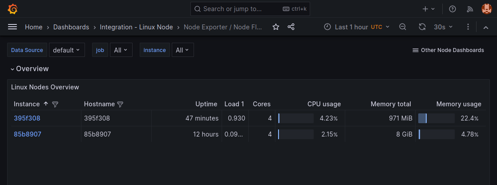

Grafana's [Agent](https://grafana.com/docs/agent/latest/) for device monitoring, packaged as a [balenaBlock](https://docs.balena.io/learn/develop/blocks/).

## Getting Started

1. Create a free account at [Grafana Cloud](https://grafana.com/products/cloud/)
1. Create a 'grafana-agent' service entry in your docker-compose, like [this example](https://github.com/balena-io-experimental/grafana-agent-block/blob/master/docs/example)
1. Set the values for the Prometheus username, password, and remote write URL environment [variables](https://docs.balena.io/learn/manage/variables/) for your fleet.

See your fleet overview dashboard like below.

